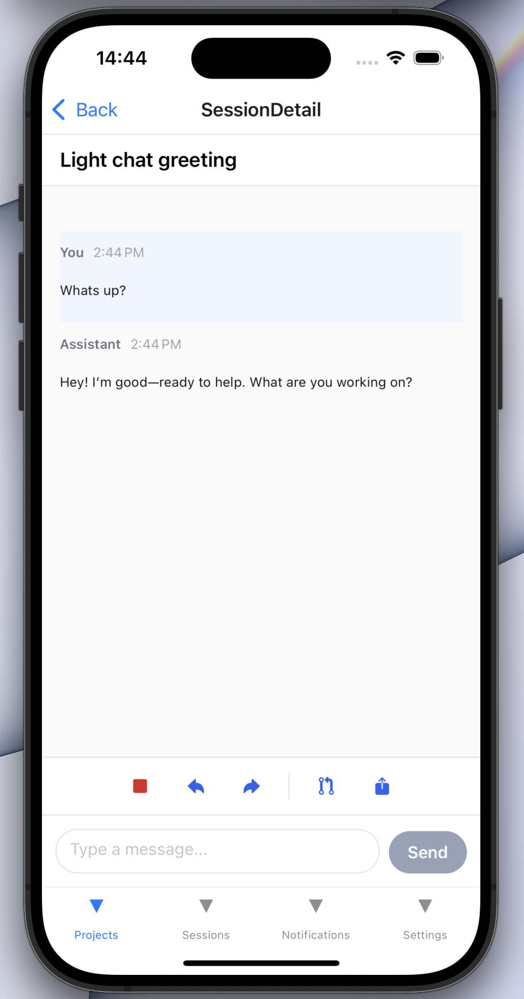
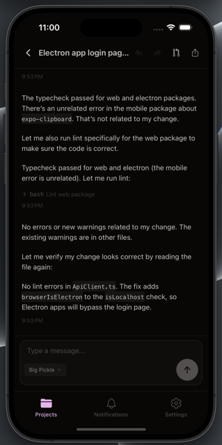
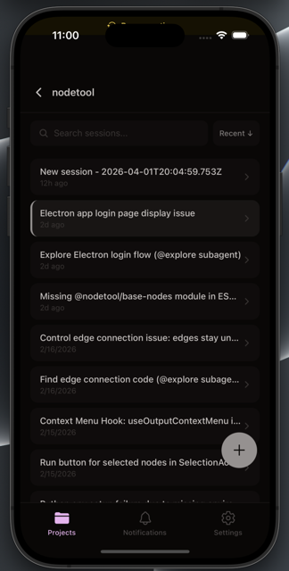
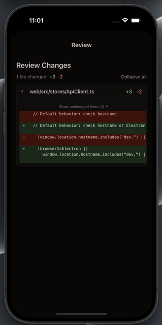

# OpenCode Expo Touch Client

A touch-first Expo app that mirrors core OpenCode web flows (projects, sessions, diffs, sharing) with mobile-first navigation and streaming responses. All API calls go through the OpenCode SDK client.

## Features
- Project and session browsing with fast, virtualized lists
- Streaming assistant responses
- Session review with diffs and summary actions
- Permission requests and inline responses
- Share links and basic server health/offline handling

## Screenshots





## Tech Stack
- Expo SDK 54 / React Native 0.81
- React Navigation (tabs + stack)
- Zustand for a single session store
- OpenCode SDK (`@opencode-ai/sdk`)

## Getting Started

### Prereqs
- Node.js + npm
- Expo CLI (via `npx expo`)
- iOS Simulator / Android Emulator or Expo Go on a device

### Install
```bash
npm install
```

### Run
```bash
npm run start
```

Then choose a platform:
- iOS: `npm run ios`
- Android: `npm run android`
- Web: `npm run web`

## Configuration
Open the **Settings** tab in the app to add a server:
- **Base URL:** defaults to `https://api.opencode.ai`
- **Directory:** repo root on the server
- **Basic auth:** optional, if your server requires it

The client persists saved servers and the current selection.

## Scripts
- `npm run start` - start Expo dev server
- `npm run ios` - run on iOS simulator
- `npm run android` - run on Android emulator
- `npm run web` - run in the browser
- `npm test` - run Jest tests
- `npm run lint` - run ESLint
- `npm run typecheck` - run TypeScript checks

## Project Structure
- `App.tsx` - app entrypoint
- `src/navigation` - tab + stack navigation
- `src/screens` - UI screens (projects, sessions, review, settings)
- `src/store` - session store and actions (single source of truth)
- `src/sdk` - OpenCode SDK client wrapper
- `src/storage` - server persistence and secure storage
- `src/utils` - shared helpers

## References
- `DESIGN.md` - architecture, flows, and UI behaviors
- `spec.expo-client.md` - invariants, error strings, and test gates
